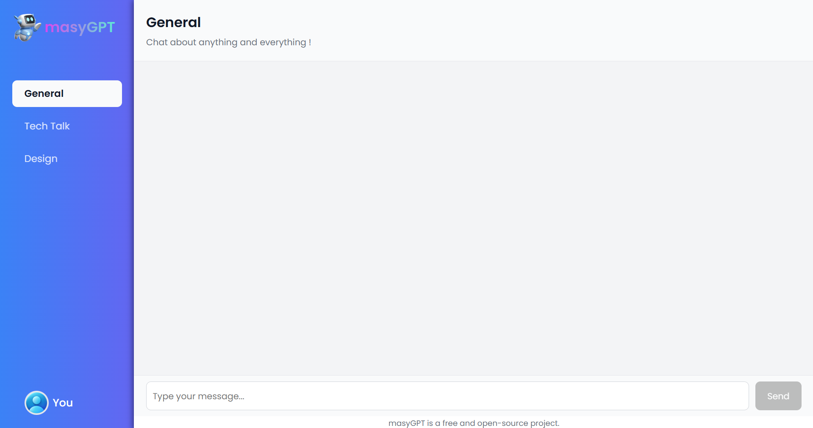

# 🤖 ChatBot_ReactJS

**masyGPT** is an intelligent chatbot application built with **ReactJS**, powered by **Google Gemini API**, designed to simulate human-like conversations. The app is deployed on **Vercel** for easy, real-time access via browser.

---

## 🖼️ Interface Preview

---

## 🌐 Live Demo

👉 Try it out now: **https://masygpt-reactjs.vercel.app**

---

## 🚀 Features

- 🧠 Smart chatbot powered by Google Gemini API
- 💬 Clean and responsive chat interface
- 📱 Fully responsive on both mobile and desktop
- ⚡ Auto-scroll, typing animations, smooth UX
- 🔐 Secure API key handling using environment variables

---

> *⚠️ This project is actively being developed. More exciting features are coming soon!*